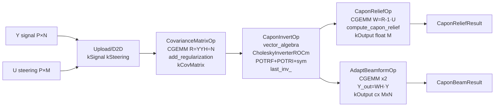

# Capon (MVDR) — Полная документация

**Namespace**: `capon` | **Каталог**: `modules/capon/`
**Зависимости**: DrvGPU, **vector_algebra** (CholeskyInverterROCm), rocBLAS, rocSOLVER, hiprtc
**Backend**: ROCm only (`ENABLE_ROCM=1`, Linux + AMD GPU)

---

## Содержание

1. [Обзор](#1-обзор)
2. [Зачем нужен / Связь с другими модулями](#2-зачем-нужен)
3. [Математика](#3-математика)
4. [Pipeline](#4-pipeline)
5. [Kernels](#5-kernels)
6. [C4 Диаграммы](#6-c4-диаграммы)
7. [API](#7-api)
8. [Тесты](#8-тесты)
9. [Файловое дерево](#9-файловое-дерево)
10. [Важные нюансы](#10-важные-нюансы)

---

## 1. Обзор

`CaponProcessor` — GPU-реализация алгоритма Кейпона (MVDR beamformer) для антенных решёток.

**Два режима:**
- **`ComputeRelief`** — пространственный MVDR-спектр: `z[m] = 1/Re(u_m^H R⁻¹ u_m)` → `float[M]`
- **`AdaptiveBeamform`** — адаптивное ДО: `Y_out = (R⁻¹U)^H Y` → `complex<float>[M×N]`

**Архитектура**: Ref03 Unified Architecture (Layer 6 Facade).

| Op-класс | Назначение | Библиотека |
|----------|-----------|------------|
| `CovarianceMatrixOp` | R = Y·Y^H/N | `MatrixOpsROCm::CovarianceMatrix` (rocBLAS CGEMM) |
| *DiagonalLoadRegularizer* | R += μI | `vector_algebra::DiagonalLoadRegularizer` (Strategy) |
| `CaponInvertOp` | R⁻¹ | `vector_algebra::CholeskyInverterROCm` (unique_ptr) |
| `ComputeWeightsOp` | W = R⁻¹·U | `MatrixOpsROCm::Multiply` (rocBLAS CGEMM) |
| `CaponReliefOp` | z[m] = 1/Re(u^H·W[m]) | HIP kernel `compute_capon_relief` (hiprtc) |
| `AdaptBeamformOp` | Y_out = W^H·Y | `MatrixOpsROCm::MultiplyConjTransA` (rocBLAS CGEMM) |

**Прототип**: `Doc_Addition/Capon/capon_test/` — ArrayFire реализация с 6 методами инверсии. Тестировалась на P=85 каналах, 25 помехах, f0=3.9 ГГц. GPUWorkLib использует typeCalc=4 (chol+inv) через `CholeskyInverterROCm`.

---

## 2. Зачем нужен

### Проблема: классическое ДО не подавляет помехи

Классическое диаграммообразование: `Y_out = U^H * Y`. Если помеха приходит из стороннего направления — она попадает в боковые лепестки, результат загрязнён.

### Решение: MVDR

MVDR минимизирует мощность выхода при ограничении — сигнал из целевого направления не искажается. Оптимальный вес: `w_m = R⁻¹ u_m / (u_m^H R⁻¹ u_m)`.

### Связь с vector_algebra

Ключевая зависимость — `vector_algebra::CholeskyInverterROCm` (POTRF+POTRI+symmetrize). **Capon не реализует инверсию сам** — делегирует полностью. Это исключает дублирование кода и использует уже оптимизированный и протестированный модуль.

### Связь с statistics

`CovarianceMatrixOp` — накопление по N отсчётам, как `MeanReductionOp` и `WelfordFusedOp` в statistics. Отличие: result — матрица [P×P] (GEMM Y·Y^H), а не скаляр. Диагональная загрузка `add_regularization` аналогична epsilon-стабилизации в WelfordFused.

### Методы инверсии (прототип ArrayFire)

| typeCalc | Метод | В GPUWorkLib |
|----------|-------|-------------|
| 0 | linsolve | — |
| 1 | linsolve + Cholesky | — |
| 2 | `af::inverse(R)` | — |
| 3 | итерации Шульца | — |
| **4** | **chol + inv (POTRF+POTRI)** | ✅ через CholeskyInverterROCm |
| 5 | Шульц batch | — |
| 6 | SVD | — |

---

## 3. Математика

### Ковариационная матрица

$$R = \frac{1}{N} Y Y^H + \mu I \in \mathbb{C}^{P \times P}$$

$Y \in \mathbb{C}^{P \times N}$ — матрица сигнала, $\mu \geq 0$ — диагональная загрузка, гарантирует HPD.

### Инверсия Холецкого

$$R = L L^H \;\;(\text{POTRF}) \;\;\Rightarrow\;\; R^{-1} \;\;(\text{POTRI})$$

После POTRI верхний треугольник содержит R⁻¹. HIP kernel `symmetrize_upper_to_full` (из vector_algebra) заполняет нижний.

### Рельеф Кейпона

$$z[m] = \frac{1}{\text{Re}(u_m^H R^{-1} u_m)}, \quad m = 0,\ldots,M-1$$

Через промежуточную матрицу $W = R^{-1} U \in \mathbb{C}^{P \times M}$:

$$z[m] = \frac{1}{\displaystyle\sum_{p=0}^{P-1} \text{Re}\!\left(\bar{u}_{pm} \cdot w_{pm}\right)}$$

### Адаптивное ДО

$$W = R^{-1} U \in \mathbb{C}^{P \times M}, \qquad Y_{\text{out}} = W^H Y \in \mathbb{C}^{M \times N}$$

### Управляющие векторы (ULA, d/λ=0.5)

$$u_p(\theta) = \exp\!\left(j \cdot 2\pi \cdot p \cdot 0.5 \cdot \sin\theta\right)$$

Для 2D ФАР (из прototипа, несущая $f_0$):

$$U_{pm} = \frac{1}{\sqrt{P}} \exp\!\left(j \cdot \frac{2\pi f_0}{c}(x_p u_m + y_p v_m)\right)$$

---

## 4. Pipeline

### ComputeRelief

```
Y [P×N]  U [P×M]
    │         │
    ▼         ▼
┌────────────────────────────────────────────────┐
│ 1. Upload / CopyGpu                             │
│    H2D: Y → kSignal,  U → kSteering           │
│    D2D: CopySignalGpu / CopySteeringGpu        │
└────────────────────────────────────────────────┘
    │
    ▼
┌────────────────────────────────────────────────┐
│ 2. CovarianceMatrixOp::Execute(P, N, mu)        │
│    rocBLAS CGEMM: R = Y*Y^H/N  ✅         │
│    HIP add_regularization: R[i,i] += mu         │
│    → kCovMatrix [P×P]                          │
└────────────────────────────────────────────────┘
    │
    ▼
┌────────────────────────────────────────────────┐
│ 3. CaponInvertOp::Execute(R_gpu, P)             │
│    → vector_algebra::CholeskyInverterROCm       │
│       POTRF: R = L·L^H                          │
│       POTRI: L → R⁻¹ (верхний треугольник)      │
│       HIP symmetrize_upper_to_full              │
│    → last_inv_ (CholeskyResult, GPU ptr)        │
└────────────────────────────────────────────────┘
    │
    ▼
┌────────────────────────────────────────────────┐
│ 4. CaponReliefOp::Execute(P, M, R⁻¹_ptr)       │
│    rocBLAS CGEMM: W = R⁻¹·U [P×M]  ✅    │
│    HIP compute_capon_relief:                    │
│      z[m] = 1/Re(Σ_p conj(U[p,m]) * W[p,m])   │
│    → kOutput float[M]                           │
└────────────────────────────────────────────────┘
    │
    ▼
ctx_.Synchronize() → ReadReliefResult() → CaponReliefResult
```

### AdaptiveBeamform (шаги 1–3 идентичны)

```
(Upload + CovarianceMatrixOp + CaponInvertOp — идентично)
    │
    ▼
┌────────────────────────────────────────────────┐
│ 4. AdaptBeamformOp::Execute(P, N, M, R⁻¹_ptr)  │
│    CGEMM 1: W = R⁻¹·U [P×M]        ✅    │
│    CGEMM 2: Y_out = W^H·Y [M×N]    ✅    │
│    → kOutput complex<float>[M×N]               │
└────────────────────────────────────────────────┘
    │
    ▼
ctx_.Synchronize() → ReadBeamResult() → CaponBeamResult
```

### Mermaid



---

## 5. Kernels

Два небольших HIP kernel (hiprtc). Источник: `include/kernels/capon_kernels_rocm.hpp` → `GetCaponKernelSource()`.

Все тяжёлые GEMM-операции и инверсия — через rocBLAS/rocSOLVER (не hiprtc).

### add_regularization

**Назначение**: R[i,i] += mu — делает R HPD для POTRF.

```c
// grid=(P+255)/256, block=256, каждый thread i → диагональный элемент
extern "C" __global__ void add_regularization(float2* R, float mu, unsigned int P) {
  unsigned int i = blockIdx.x * blockDim.x + threadIdx.x;
  if (i >= P) return;
  R[i * P + i].x += mu;  // column-major: R[i,i] → индекс i*P + i
}
```

### compute_capon_relief

**Назначение**: z[m] = 1/Re(u_m^H · w_m) после W = R⁻¹·U через rocBLAS.

```c
// grid=(M+255)/256, block=256, каждый thread m → одно направление
extern "C" __global__ void compute_capon_relief(
    const float2* U, const float2* W, float* z, unsigned int P, unsigned int M) {
  unsigned int m = blockIdx.x * blockDim.x + threadIdx.x;
  if (m >= M) return;
  float acc = 0.0f;
  for (unsigned int p = 0; p < P; ++p) {
    float2 u = U[m*P + p], w = W[m*P + p];
    acc += u.x*w.x + u.y*w.y;  // Re(conj(u)*w)
  }
  z[m] = (acc > 0.0f) ? (1.0f / acc) : 0.0f;
}
```

### rocBLAS операции (TODO)

| Операция | rocBLAS |
|----------|---------|
| R = (1/N)·Y·Y^H | `rocblas_cgemm(NoTrans, ConjTrans, P,P,N, 1/N, Y,P, Y,P, 0, R,P)` |
| W = R⁻¹·U | `rocblas_cgemm(NoTrans, NoTrans, P,M,P, 1, Rinv,P, U,P, 0, W,P)` |
| Y_out = W^H·Y | `rocblas_cgemm(ConjTrans, NoTrans, M,N,P, 1, W,P, Y,P, 0, Yout,M)` |

---

## 6. C4 Диаграммы

### C1 — Контекст

```
Антенная система / ФАР
  Y [P×N], U [P×M]  →  CaponProcessor (ROCm GPU)
                        → CaponReliefResult (z[M])
                        → CaponBeamResult (Y_out[M×N])
```

### C2 — Контейнеры

```
modules/capon/
  CaponProcessor (Facade, L6)
  ├── GpuContext ctx_             stream, compiled kernels, shared bufs
  ├── CovarianceMatrixOp          GpuKernelOp: rocBLAS CGEMM ✅ + add_regularization
  ├── CaponInvertOp               НЕ GpuKernelOp — обёртка CholeskyInverterROCm
  │     └── CholeskyInverterROCm  ← modules/vector_algebra/ (POTRF+POTRI+symmetrize)
  ├── CaponReliefOp               GpuKernelOp: rocBLAS CGEMM ✅ + compute_capon_relief
  ├── AdaptBeamformOp             GpuKernelOp: 2x rocBLAS CGEMM ✅
  └── CholeskyResult last_inv_    R⁻¹ на GPU (RAII, обновляется каждый вызов)
```

### C3 — Компоненты CaponProcessor

```
EnsureCompiled()  [ленивый, один раз]
  ctx_.CompileModule(GetCaponKernelSource(), {"add_regularization","compute_capon_relief"})
  cov_op_.Initialize(ctx_) / relief_op_.Initialize(ctx_) / beam_op_.Initialize(ctx_)
  inv_op_.CompileKernels()   // warmup symmetrize kernel

RunCovAndInvert(params)   [общий шаг для обоих режимов]
  cov_op_.Execute(P, N, mu)
  last_inv_ = inv_op_.Execute(kCovMatrix_ptr, P)

ComputeRelief()    = Upload + RunCovAndInvert + relief_op_.Execute + Sync + Read
AdaptiveBeamform() = Upload + RunCovAndInvert + beam_op_.Execute  + Sync + Read
```

### C4 — HIP kernel compute_capon_relief

```
Thread grid: ceil(M/256) блоков × 256 threads
  m = blockIdx.x * blockDim.x + threadIdx.x
  if m >= M: return
  acc = 0
  for p = 0..P-1:
    u = U[m*P+p],  w = W[m*P+p]     // column-major
    acc += u.x*w.x + u.y*w.y         // Re(conj(u)*w)
  z[m] = (acc>0) ? 1/acc : 0         // защита от нуля
```

---

## 7. API

Полный API-справочник: [API.md](API.md)

### C++ — полный пример

```cpp
#include "capon_processor.hpp"

// Параметры (P=8 каналов, N=128 отсчётов, M=32 направления)
capon::CaponParams params{8, 128, 32, 0.01f};
capon::CaponProcessor proc(backend);

// Y [P×N], U [P×M] — complex<float>, column-major
// ULA: U[m*P+p] = exp(j * 2π * p * 0.5 * sin(θ[m]))

// Рельеф — пространственный спектр
auto relief = proc.ComputeRelief(Y, U, params);
auto peak = std::max_element(relief.relief.begin(), relief.relief.end());
size_t main_dir = peak - relief.relief.begin();

// Адаптивные лучи
auto beam = proc.AdaptiveBeamform(Y, U, params);
// beam.output[main_dir * 128 + n] — сигнал в главном направлении
```

### Python — NumPy эталон

```python
import numpy as np

def capon_relief_numpy(Y, U, mu=0.01):
    P, N = Y.shape
    R = (Y @ Y.conj().T) / N + mu * np.eye(P, dtype=complex)
    R_inv = np.linalg.inv(R)
    W = R_inv @ U
    return (1.0 / np.real(np.sum(U.conj() * W, axis=0))).astype(np.float32)

def capon_beamform_numpy(Y, U, mu=0.01):
    P, N = Y.shape
    R = (Y @ Y.conj().T) / N + mu * np.eye(P, dtype=complex)
    W = np.linalg.inv(R) @ U
    return (W.conj().T @ Y).astype(np.complex64)

def make_ula_steering(P, thetas_rad):
    p = np.arange(P)[:, np.newaxis]
    return np.exp(1j * 2*np.pi * 0.5 * np.sin(thetas_rad) * p).astype(np.complex64)
```

---

## 8. Тесты

### Тестовые данные

```
MakeNoise:            re[i] = σ·cos(i·1.23),  im[i] = σ·sin(i·2.34)  [детерминированный]
MakeSteeringMatrix:   U[m*P+p] = exp(j·2π·p·0.5·sin(θ_m)),  θ_m ∈ [θ_min, θ_max]
```

### C++ тесты — test_capon_rocm.hpp (базовые)

| # | Тест | P | N | M | mu | Что проверяет | Порог |
|---|------|---|---|---|----|---------------|-------|
| 01 | `relief_noise_only` | 8 | 64 | 16 | 0.01 | Все z[m] > 0, isfinite, size==M | > 0 |
| 02 | `relief_with_interference` | 8 | 128 | 32 | 0.001 | MVDR подавление: z[m_int] < mean(z)/2 | < mean/2 |
| 03 | `adaptive_beamform_dims` | 4 | 32 | 6 | 0.01 | output.size()==M×N, isfinite | точное |
| 04 | `regularization` | 4 | 8 (N<P) | 8 | 0.1 | isfinite && ≥ 0 при вырожденной матрице | isfinite |
| 05 | `gpu_to_gpu` | 8 | 64 | 16 | 0.01 | hipMalloc→hipMemcpy→void* API→z[m]>0 | > 0 |

### C++ тесты — test_capon_reference_data.hpp (MATLAB данные)

Данные: `Doc_Addition/Capon/capon_test/build/` (x_data, y_data, signal_matlab).

| # | Тест | Параметры | Порог |
|---|------|-----------|-------|
| 01 | load_files | — | SKIP если нет файлов |
| 02 | physical_relief_properties | P=85, N=1000, M=1369, mu=1.0 | all z[m] > 0 |
| 03 | cpu_vs_gpu_small_p | P=8, N=64, M=16, mu=100 | max_rel_error < 0.5% |

### C++ тесты — test_capon_opencl_to_rocm.hpp (Zero Copy)

| # | Тест | Что проверяет |
|---|------|---------------|
| 01 | detect_interop | Метод Zero Copy: AMD_GPU_VA / DMA_BUF / NONE |
| 02 | signal_from_opencl | CPU→cl_mem→ZeroCopy→hip→ComputeRelief: z[m]>0 |
| 03 | results_match_ref | Zero Copy путь == прямой CPU путь (< 1e-4) |
| 04 | beamform_from_opencl | AdaptiveBeamform через cl_mem → [M×N] isfinite |

### Бенчмарки — capon_benchmark.hpp + test_capon_benchmark_rocm.hpp

| Класс | Метод | Параметры | Runs |
|-------|-------|-----------|------|
| `CaponReliefBenchmarkROCm` | ComputeRelief | P=16, N=256, M=64 | 5+20 |
| `CaponBeamformBenchmarkROCm` | AdaptiveBeamform | P=16, N=256, M=64 | 5+20 |

Результаты → `Results/Profiler/GPU_00_Capon_ROCm/`. Запуск при `is_prof=true`.

### Python тесты — `Python_test/capon/test_capon.py`

| Класс | Тесты | Описание |
|-------|-------|----------|
| `TestCaponReference` | 8 тестов | NumPy эталон: shape, positive, finite, suppression, regularization |
| `TestCaponGPU` | 2 теста | Запуск C++ тестов, проверка PASS |
| `TestCaponRealData` | 6 тестов | MATLAB данные P=85, корреляция > 0.99 |

---

## 9. Файловое дерево

```
modules/capon/
├── CMakeLists.txt                        ROCm+rocBLAS+rocSOLVER+vector_algebra
├── include/
│   ├── capon_types.hpp                   CaponParams, CaponReliefResult, CaponBeamResult, shared_buf
│   ├── capon_processor.hpp               Facade (Ref03 L6)
│   ├── kernels/
│   │   └── capon_kernels_rocm.hpp        GetCaponKernelSource() — hiprtc kernel sources
│   └── operations/
│       ├── covariance_matrix_op.hpp      L5: R = Y*Y^H/N + μI
│       ├── capon_invert_op.hpp           L5: обёртка CholeskyInverterROCm (не GpuKernelOp)
│       ├── capon_relief_op.hpp           L5: z[m] = 1/Re(u^H R⁻¹ u)
│       └── adapt_beam_op.hpp             L5: Y_out = (R⁻¹U)^H Y
├── src/
│   └── capon_processor.cpp               Facade + Upload/Copy/Read + Move semantics
└── tests/
    ├── all_test.hpp                       capon_all_test::run()
    ├── capon_test_helpers.hpp               Общие хелперы: MakeNoise, MakeSteeringMatrix, shared backend
    ├── test_capon_rocm.hpp                5 базовых тестов (01-05)
    ├── test_capon_reference_data.hpp      3 теста на MATLAB данных (CPU vs GPU)
    ├── test_capon_opencl_to_rocm.hpp      4 теста Zero Copy (OpenCL→ROCm)
    ├── capon_benchmark.hpp                Benchmark классы (GpuBenchmarkBase)
    ├── test_capon_benchmark_rocm.hpp      Benchmark runner
    ├── GUIDE_opencl_to_rocm.md            Руководство: паттерн Zero Copy
    └── README.md

Doc_Addition/Capon/capon_test/            ArrayFire прототип (CPU)
├── src/capon_relief.cpp                  keypon_relief(), adapt(), adapt_beams() — 6 методов инверсии
└── include/inv_schulz.h                  Schulz iterations (typeCalc=3/5)

modules/vector_algebra/                   Зависимость — инверсия R⁻¹
└── include/cholesky_inverter_rocm.hpp    CholeskyInverterROCm: POTRF+POTRI+symmetrize
```

---

## 10. Важные нюансы

1. **ROCm-only.** `CMakeLists.txt` пропускает модуль (`return()`) при отсутствии `ROCM_ENABLED`, `rocblas_FOUND` или `rocsolver_FOUND`.

2. **Column-major обязателен.** rocBLAS/rocSOLVER — column-major. `[p, m]` → `m*P + p`. NumPy: `np.asfortranarray(Y)` или `order='F'`.

3. **N < P без mu → POTRF fail.** При N < P матрица $YY^H/N$ вырождена → не HPD → POTRF вернёт `info != 0` → исключение. Всегда `mu > 0`.

4. **CaponInvertOp в unique_ptr.** `CholeskyInverterROCm` non-copyable → `inv_op_` хранится как `unique_ptr<CaponInvertOp>` → корректный move. В `~CaponProcessor()` `inv_op_` освобождается автоматически.

5. **ComputeWeightsOp — единый CGEMM.** W = R⁻¹·U вычисляется один раз в `RunComputeWeights()` → `kWeight`. `CaponReliefOp` и `AdaptBeamformOp` не дублируют CGEMM.

6. **DiagonalLoadRegularizer — Strategy.** R[i,i] += μ через `IMatrixRegularizer` (vector_algebra). mu==0 → no-op.

7. **last_inv_ пересоздаётся каждый вызов.** `RunCovAndInvert()` делает `last_inv_ = ...` — старый `CholeskyResult` (с `hipFree`) уничтожается. Нельзя хранить `AsHipPtr()` дольше одного пайплайна.

8. **GPU-to-GPU и Zero Copy.** `ComputeRelief(void*, void*, params)` принимает HIP device pointers. Совместимо с `ZeroCopyBridge` (OpenCL→ROCm без DMA). См. `tests/GUIDE_opencl_to_rocm.md`.

9. **Первый вызов медленнее.** `EnsureCompiled()` компилирует hiprtc (~200 мс) + `inv_op_->CompileKernels()` warmup.

---

*Обновлено: 2026-03-24*
*[Quick.md](Quick.md) | [API.md](API.md)*
